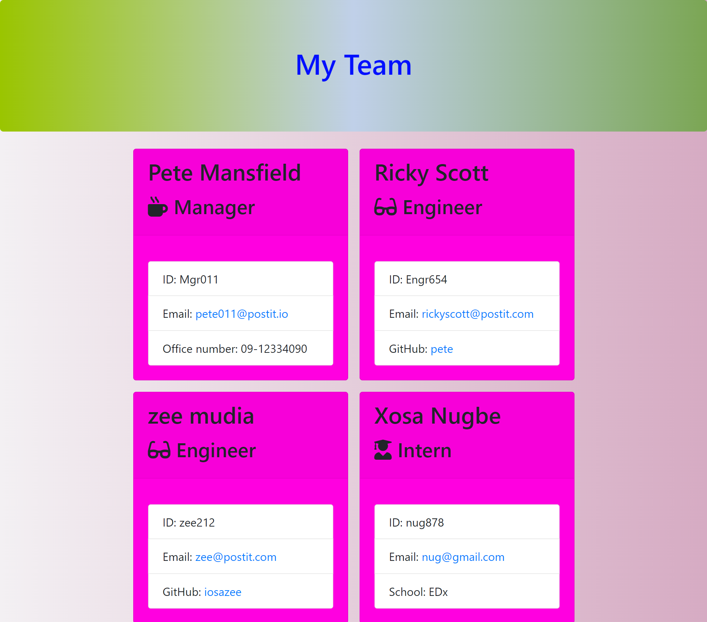

# TEAM PROFILE GENERATOR


## Description

This is a node.JS application that provides a command line interface for providing information about employees of a software engineering company  and generates an HTML page based on the information provided.

## Table of Contents

* [Installation](#installation)

* [Usage](#usage)

* [License](#license)

* [Tests](#tests)

* [Questions](#questions)

## Installation

```
    To install this application, simply download the source code to your local machine, unzip the folder and cd into the folder containing the package.json file. Run the command npm install to install all the neccessary dependencies.
```

## Usage

To use this app, ensure that you are in the folder containing the index.js file, run the command node index.js on the terminal to start the app. You will then be presented with a series of questions, and an HTML page will be generated in the output folder based on your answers to the questions.
* 


## License
This project is licensed under the MIT license. Read the fine print of [MIT license](./license)


## Tests

```
There are several tests provided to test that the various employee classes meet all the requirements. To run these tests simply enter the command npm run test in the terminal.
```

## Questions

If you have any questions you can contact me at [this email]](iosazee1@gmail.com).

You can see more of my work at [my github's profile](https://github.com/iosazee).


<font size="1">This README was generated by [README-Generator](https://github.com/iosazee/README-Generator)</font>